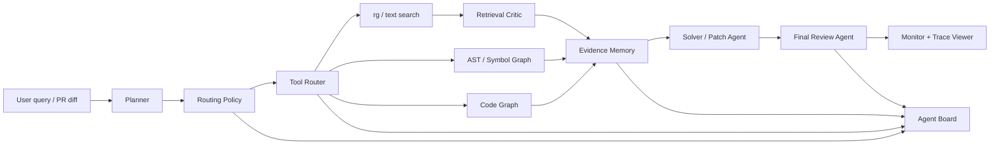

# Multi-Agent Code Review Lab

一个本地优先、面向代码库理解、问题定位、PR 风险审查、轻量修复验证和 Agent 工作流评测的多 Agent 工程工具。

当前阶段已进入可运行 MVP：CLI、Web Review Workbench、DeepSeek Provider、Agent Board、Tool Router、Retrieval Critic、`rg + AST + Symbol Graph`、patch verification、eval report、本地 trace viewer 和 GitHub PR workflow 都已跑通。

> Scope: this is a local-first developer tool, not a hosted multi-tenant SaaS. It is designed for evidence-driven code review experiments, local repository analysis, PR risk detection, and agent workflow evaluation.

## Quick Start

无需 API key 即可跑通本地 demo：

```bash
scripts/check_demo_ready.sh
```

手动运行一个样例问题：

```bash
python3 cli/agent_review.py ask \
  --repo sample_repos/sample_python_api \
  "这个接口在哪里鉴权？"
```

启动本地 Web Review Workbench：

```bash
python3 cli/agent_review.py view --port 8765
```

打开：

```text
http://127.0.0.1:8765
```

## Architecture At A Glance



## Why Not Just Call An LLM API?

代码审查需要可验证证据，而不是只生成自然语言答案。本项目把 LLM 放在合适的位置：

- 先用 `rg`、AST、Symbol Graph、Code Graph 获取文件、行号、符号和调用关系。
- Agent 通过 `AgentBoard` 写入结构化 artifact，而不是靠隐式上下文传话。
- `RoutingPolicyAgent` 会跳过不必要的 Agent 和 API 调用，低风险任务优先走确定性路径。
- `FinalReviewAgent` 会检查证据、置信度、contract、code smell 和 patch verification。
- Trace Viewer 展示每一步发生了什么、为什么这样路由、哪里需要人工审核。

## 适用用户

这个项目适合：

- 想在本地审查中小型 Python 仓库的开发者。
- 想把 PR diff 转换成结构化 review comments / SARIF 的维护者。
- 想研究 multi-agent code review、evidence-first retrieval、Agent Board 和评测闭环的工程人员。
- 想对比规则工具、代码结构分析和少量 LLM 调用如何协作的 LLM 应用开发者。

当前边界：

- 默认面向本地可信环境和个人/团队内部实验。
- 不提供公网多租户鉴权、容器级沙箱或企业级安全扫描承诺。
- 输出应作为 review 辅助信号，不能替代人工审核。

核心能力：

- 多 Agent 协作：Planner、Tool Router、Retrieval Critic、Code Search、AST/Symbol、LSP、Patch、Verifier、Monitor。
- 工具调用：`rg`、AST parser、LSP、git、test runner、compiler/type checker、少量 embedding search。
- 代码证据链：回答必须绑定文件、行号、符号、调用链或测试日志。
- Agent 评测：离线评测集、trace 日志、工具成功率、幻觉引用率、token/latency 成本。
- 线上表现监控：Monitor Agent 汇总失败类型并给出优化建议。

## 目标流程

```text
User Query
  -> Planner Agent
  -> Tool Router
      -> rg
      -> AST parser
      -> LSP
      -> git
      -> test runner
      -> compiler / type checker
      -> embedding search
  -> Evidence Memory
  -> Solver / Patch Agent
  -> Verifier Agent
  -> Monitor Agent
  -> Trace + Evaluation Report
```

## LLM Provider 策略

DeepSeek 已作为第一版真实 Provider 接入；规则 Provider 和 Mock Provider 仍保留，用于无 API key 场景、单元测试和可复现 eval。

- `MockLLMProvider`: 返回固定结构，用于测试 planner、router、trace、eval。
- `RuleBasedPlanner`: 根据关键词识别任务类型。
- `DeepSeekProvider`: 支持 `llm-check`、LLM Planner、LLM Solver 和 LLM Patch candidate。
- `Provider Interface`: 预留 OpenAI / Qwen / Claude 接入。
- 所有 LLM 调用都统一记录 model、prompt version、latency、token、cost 字段，即使 mock 阶段这些字段为空或估算。

## 文档

- [项目大纲](docs/project_outline.md)
- [Agent Framework Mapping](docs/agent_framework_mapping.md)
- [Agent 系统升级计划](docs/agent_system_upgrade_plan.md)
- [多 Agent 系统试错、技术演进与测试问题记录](docs/multi_agent_system_evolution.md)
- [真实数据测试计划](docs/real_data_testing_plan.md)
- [LLM API 选择建议](docs/llm_api_recommendation.md)
- [Release Checklist](docs/RELEASE_CHECKLIST.md)

## 开源与安全边界

- 本项目采用 MIT License。
- `.env`、API key、私有 trace、上传的代码 zip、外部真实仓库 checkout 不应提交到 GitHub。
- Web Review Workbench 默认用于 `127.0.0.1` 本地运行，不建议直接暴露到公网。
- 详细安全边界见 [SECURITY.md](SECURITY.md)。

## 当前已搭建能力

Phase 0 / Phase 1 骨架已具备：

- `agent-review ask`: 对单个代码库问题生成 plan、工具调用、证据和 trace。
- `agent-review patch`: 生成小范围 patch artifact，在临时副本中验证 patch apply 和测试结果，不直接修改目标仓库。
- `agent-review review-diff`: 对 unified diff 或当前 `git diff` 生成 PR 风格风险摘要、review comments、测试建议和 trace，并支持 `text/json/sarif/github` 输出。
- `agent-review eval`: 批量运行 JSONL 评测集并生成 Markdown 报告。
- `agent-review prepare-real-eval`: 将 SWE-bench、CodeSearchNet 或手工 GitHub issue JSONL 转换为本项目 eval 格式，用于真实仓库测试。
- `agent-review code-smell`: 计算 Python 仓库的 code smell ratio、维护性风险等级和热点函数。
- `agent-review view`: 启动本地 Web Review Workbench + Trace Viewer，支持上传代码 zip 后以后台 job 做问答分析或 diff review，并展示 plan、tool calls、evidence、patch verification 和 eval report。
- `AgentBoard`: 共享信息板，Agent 按固定区块写入 task、plan、policy、routing、repo map、retrieval、retrieval critique、code intelligence、code graph、evidence、review、pr review、patch、verification、monitor。
- `Workflow Graph`: 以 LangGraph-style 的状态图方式描述 task、planner、policy、router、retrieval、code intelligence、solver、final review、patch、monitor 等节点，记录条件边、执行/跳过原因和 checkpoint。
- `RoutingPolicyAgent`: 在执行前判断哪些 Agent/工具/API 调用值得运行，低风险任务优先规则路径，明显过剩的 LLM/API 调用会被跳过并记录原因。
- `ToolRouterAgent`: 独立路由 Agent，读取 Plan 和 Board，输出 tool call schedule；每个 tool call 记录 router reason。
- `RepoMapAgent`: 在检索前生成仓库结构摘要、focus files 和 top symbols，提供类似 repo map 的全局上下文，降低纯关键词检索的偶然性。
- `RetrievalCriticAgent`: 评估检索质量，识别 `empty_recall`、证据不足和 symbol recall 薄弱场景，向 Router 追加 query rewrite / symbol expansion。
- `CodeGraphTool`: 构建 file/function/class/import/call/test-reference 图，补充调用链、影响面和相关测试证据。
- `Persistent Code Graph Index`: 将仓库 Python AST 图缓存在本项目 `.macr_cache/code_graph/`，用文件路径、mtime、size 指纹判断是否复用，避免重复建图。
- `PatchRankerAgent`: 对 LLM/template patch candidates 分别验证并打分，优先选择可应用、测试通过、小范围的候选补丁。
- `DiffReviewAgent`: 面向 PR 工作流审查 diff，识别高风险执行、疑似密钥、裸 `except`、debug print、大 hunk、缺测试等工程风险。
- `Cost Optimizer`: 使用稳定 prompt 前缀提升 DeepSeek Context Caching 命中机会，压缩动态 evidence payload，并在 trace/monitor 中记录 cache hit ratio 和估算成本。
- `Run State Timeline`: 每次 run 记录 task received、planned、routed、evidence built、solved、patching、contract validated、completed 等状态。
- `BoardContractValidator`: 校验 Agent Board 必须产出的关键 artifact 和 payload 字段，结果写入 monitor metrics。
- `FinalReviewAgent`: 汇总检查前序 Agent 的证据、置信度、工具状态、contract、patch verification；低置信度时触发一次 recovery，仍失败则标记人工审核问题。
- `CodeSmellAgent`: 基于 AST 和文件指标计算 code smell ratio，识别长函数、高分支复杂度、大文件、裸 `except`、参数过多等维护性风险，并纳入 Final Review。
- `RuleBasedPlanner`: 在无 API key、测试或 fallback 场景中完成任务分类和工具计划。
- `LlmPlanner`: DeepSeek 可用时生成结构化计划，失败时回落规则 Planner。
- `MockLLMProvider`: 用于无网络、无 API key 和单元测试场景。
- 工具链：`rg` 文本检索、Python AST 解析、Symbol Graph、Code Graph、git log、pytest/unittest test runner。
- Trace Viewer 展示 Agent Board，可审查每个 Agent 的中间产物、检索纠错、信息交接和 verifier 结果。
- Trace Viewer 展示 State Timeline、Workflow Graph、Agent Flow Map、Health Signals、Contract 状态、Final Audit、Human Review、工具健康概览和 eval report，方便用户判断系统跑到哪一步、产物是否完整、成本和证据质量如何。
- Web Workbench 使用后台 job 和 `/jobs/<id>.json` 状态轮询；上传 zip 会做路径穿越、symlink、文件数量和解压体积检查，job 结束后清理临时目录。
- 样例代码库：`sample_repos/sample_python_api`。
- Phase 1 评测集：`eval_sets/phase1.jsonl`。

## 本地运行

单条任务：

```bash
python3 cli/agent_review.py ask \
  --repo sample_repos/sample_python_api \
  "这个接口在哪里鉴权？"
```

使用 DeepSeek 生成 Solver 回答：

```bash
python3 cli/agent_review.py ask \
  --provider deepseek \
  --repo sample_repos/sample_python_api \
  "这个接口在哪里鉴权？"
```

使用 DeepSeek Planner + Solver：

```bash
python3 cli/agent_review.py ask \
  --provider deepseek \
  --llm-planner \
  --repo sample_repos/sample_python_api \
  "process_payment 的调用链涉及哪些模块？"
```

输出 JSON trace：

```bash
python3 cli/agent_review.py ask \
  --provider deepseek \
  --repo sample_repos/sample_python_api \
  --json \
  "登录失败为什么还能访问接口？"
```

生成并验证补丁 artifact：

```bash
python3 cli/agent_review.py patch \
  --repo sample_repos/sample_python_api \
  --test-selector tests \
  "银行卡扣款失败会在哪里返回 402？请给出最小修复"
```

使用 DeepSeek 生成候选 patch，再由 Verifier 筛选：

```bash
python3 cli/agent_review.py patch \
  --provider deepseek \
  --llm-patch \
  --repo sample_repos/sample_python_api \
  --test-selector tests \
  "银行卡扣款失败会在哪里返回 402？请给出最小修复"
```

补丁会写入 `patches/*.patch`，Verifier 会在临时副本里执行：

- `git apply --check`
- `git apply`
- `pytest` 或 `unittest`

默认不会直接修改目标代码库。
如果 LLM 生成的 patch 无法应用或测试失败，系统会回退到安全模板 patch，并在 trace 中保留失败工具调用记录。

运行 Phase 1 eval：

```bash
python3 cli/agent_review.py eval \
  --eval-file eval_sets/phase1.jsonl \
  --repo-root . \
  --report reports/phase1_eval.md
```

启动本地 Web Review Workbench + Trace Viewer：

```bash
python3 cli/agent_review.py view --port 8765
```

打开：

```text
http://127.0.0.1:8765
```

网页端使用方式：

- 打开 `http://127.0.0.1:8765`。
- 在 `Web Review Workbench` 上传代码 zip。
- 选择 `Codebase question / analysis` 并输入问题，或选择 `Diff review` 并粘贴/上传 unified diff。
- 提交后网页会运行同一套 Orchestrator，并直接展示最新 trace。
- 网页端任务会进入后台 job，完成后页面自动刷新最新 trace。

健康检查：

```text
http://127.0.0.1:8765/health
```

运行当前测试：

```bash
PYTHONPATH=src python3 -m unittest discover -s tests
```

单独查看 code smell ratio：

```bash
python3 cli/agent_review.py code-smell \
  --repo sample_repos/sample_python_api
```

审查一个 unified diff：

```bash
python3 cli/agent_review.py review-diff \
  --repo sample_repos/sample_python_api \
  --diff-file patches/00ec07f3-1e41-4356-b6df-844e147286fa.patch
```

审查当前仓库未提交变更并输出 SARIF：

```bash
python3 cli/agent_review.py review-diff \
  --repo path/to/repo \
  --format sarif \
  --output reports/review.sarif.json
```

输出 GitHub Review Comments JSON：

```bash
python3 cli/agent_review.py review-diff \
  --repo path/to/repo \
  --format github \
  --output reports/review_comments.json
```

GitHub PR 集成：

- `.github/workflows/macr-review.yml` 会在 PR 中生成 SARIF，并把 review comments 发布到 PR。
- `scripts/post_github_review.py` 可单独把 `--format github` 的输出发布为 GitHub PR review；本地可先用 `--dry-run` 检查 payload。

## 当前评测结果

当前 `eval_sets/phase1.jsonl` 包含 20 条样例，覆盖 auth、order、payment、notification、test failure 和 call graph 场景：

- `task_success_rate`: 1.0
- `file_hit_rate`: 1.0
- `symbol_hit_rate`: 1.0
- `avg_expected_file_recall`: 0.975
- `avg_expected_symbol_recall`: 0.925
- `avg_evidence_count`: 12.0
- `avg_tool_calls`: 10.25
- `tool_call_failure_rate`: 0.0
- `empty_recall_rate`: 0.137
- `final_review_pass_rate`: 1.0
- `human_review_required_rate`: 0.0
- `avg_code_smell_ratio`: 0.0

说明：`empty_recall` 表示探索性搜索词没有命中，例如 `call` / `reference` 这类泛化查询。它会进入 Retrieval Critic，由 Critic 判断是否追加 query rewrite 或 symbol expansion；它不计为硬工具失败，Trace Viewer 中显示为 `miss`。

LLM 成本监控：

- DeepSeek Provider 返回 `prompt_cache_hit_tokens` / `prompt_cache_miss_tokens` 时，trace 会估算单次调用成本。
- Monitor 汇总 `llm_cost.estimated_cost_usd`、`cache_hit_ratio` 和 prompt token 数。
- 当前默认按 DeepSeek `deepseek-v4-flash` 官方价格估算，价格可能变化，重大变更时需要更新 `src/macr/costs.py` 和本 README。

Code Graph 缓存：

- 默认缓存目录：`.macr_cache/code_graph/`。
- 缓存 key 基于 repo 绝对路径 hash。
- 缓存失效基于 Python 文件的路径、mtime 和 size fingerprint。
- 缓存目录已加入 `.gitignore`，不会污染 GitHub 展示。

Patch smoke：

- 生成 `backend/payments.py` 的 unified diff。
- `patch_apply_check`: passed
- `test_check`: passed
- 样例仓库原文件未被修改。
- LLM patch fallback 测试：passed
- Patch candidate ranking 测试：passed

Trace Viewer smoke：

- HTML render test: passed
- 展示内容：task summary、final audit、human review warning、run observability、agent flow map、health signals、state timeline、plan、tool calls、evidence、real data testing status、patch verification、monitor metrics、eval report

报告见：[reports/phase1_eval.md](reports/phase1_eval.md)。

复杂评测集：

当前 `eval_sets/phase2_complex.jsonl` 包含 30 条复杂样例，覆盖跨模块调用链、组合测试定位、patch planning、全局状态、状态码、以及 OAuth/Redis/GraphQL 这类仓库中不存在的负例场景。

- `task_success_rate`: 1.0
- `file_hit_rate`: 1.0
- `symbol_hit_rate`: 1.0
- `avg_expected_file_recall`: 0.947
- `avg_expected_symbol_recall`: 0.913
- `final_review_pass_rate`: 0.9
- `human_review_required_rate`: 0.1
- `avg_code_smell_ratio`: 0.0

说明：`human_review_required_rate` 来自 3 条故意设置的不存在功能负例，Final Review Agent 会要求人工确认，而不是假装已经找到可靠答案。

报告见：[reports/phase2_complex_eval.md](reports/phase2_complex_eval.md)。

运行复杂评测：

```bash
python3 cli/agent_review.py eval \
  --eval-file eval_sets/phase2_complex.jsonl \
  --repo-root . \
  --report reports/phase2_complex_eval.md
```

真实数据测试准备：

当前状态要区分清楚：

- 已完成：SWE-bench、CodeSearchNet、GitHub issue JSONL 的 adapter smoke test。
- 已完成：`prepare-real-eval` 可以把外部数据格式转换为本项目 eval JSONL。
- 已完成：对本地 `pallets/markupsafe` checkout 运行 4 条 GitHub issue 风格真实外部 eval。
- 真实外部 eval 结果：`task_success_rate=1.0`、`final_review_pass_rate=1.0`、`tool_call_failure_rate=0.0`、`avg_code_smell_ratio=0.031`。
- 未完成：还没有下载完整 SWE-bench Lite 数据并跑 full benchmark。
- 未完成：还没有对外部 repo 做真实 patch verification benchmark。

代表性展示见：[reports/real_data_showcase.md](reports/real_data_showcase.md)。
MarkupSafe 真实外部评测报告见：[reports/real_markupsafe_eval.md](reports/real_markupsafe_eval.md)。

```bash
python3 cli/agent_review.py prepare-real-eval \
  --source swe-bench \
  --input external_data/swe_bench_lite.jsonl \
  --repo-map external_data/repo_map.json \
  --output eval_sets/real_swe_bench_lite.jsonl \
  --limit 20
```

真实数据策略见：[docs/real_data_testing_plan.md](docs/real_data_testing_plan.md)。

## 后续接入 LLM API

当前已新增 DeepSeek Provider。配置时不要把 API key 写进代码或聊天记录，放到本地环境变量或 `.env` 文件即可。

如果你在 DeepSeek 控制台创建 key 时没有复制完整 key，列表页只能看到掩码，无法还原完整值，需要重新创建一个新 key。

### DeepSeek 配置

复制环境变量模板：

```bash
cp .env.example .env
```

编辑 `.env`：

```bash
DEEPSEEK_API_KEY=<your-deepseek-api-key>
DEEPSEEK_BASE_URL=https://api.deepseek.com
DEEPSEEK_MODEL=deepseek-v4-flash
```

在当前 shell 加载环境变量：

```bash
set -a
source .env
set +a
```

检查 API 是否可用：

```bash
python3 cli/agent_review.py llm-check --provider deepseek
```

如果返回 JSON，说明 key、base URL 和模型配置正常。

验证真实 Agent 链路：

```bash
python3 cli/agent_review.py ask \
  --provider deepseek \
  --repo sample_repos/sample_python_api \
  "这个接口在哪里鉴权？"
```

如果 DeepSeek 网络或 key 配置临时失败，CLI 会保留 `rg + AST + git` 的确定性结果作为 fallback，不会影响工具链和 eval 主流程。

后续真实 Agent 接入时，优先新增/替换 Provider，而不是改 Agent 主流程：

- `DeepSeekProvider`
- `OpenAIProvider`
- `QwenProvider`

Provider 需要实现统一接口，并写入 trace：

- provider
- model
- prompt version
- input/output tokens
- latency
- tool calls
- estimated cost
